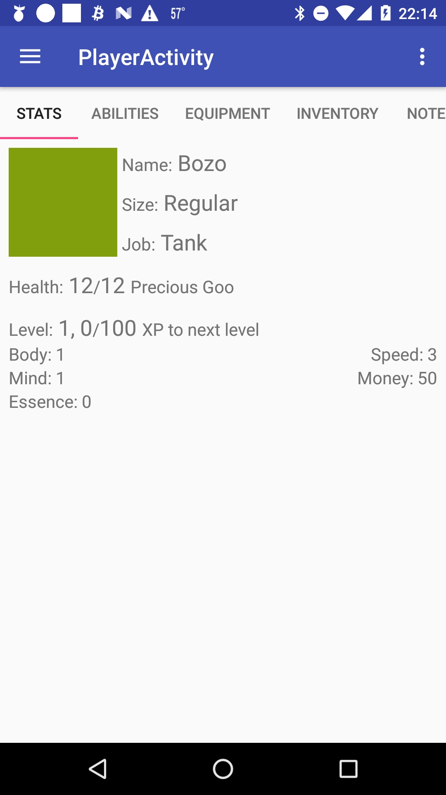

# AdventureFriends
A tabletop RPG for your Android devices

### Google play store link

https://play.google.com/store/apps/details?id=com.makalaster.adventurefriends

### Overview

This app is a platform to facilitate playing tabletop role-playing games, such as dungeons and dragons. The current version of the app includes an example game created for this project called "Goblins? Goblins!". Users are able to create and join game campaigns, create and manage sessions of each campaign, create and manage characters, and share a map, all through their Android devices. This eliminates the need for maintaining paper copies of books or character sheets, and helps users stay organized. It also helps reduce the need to be physically with one another in order to play a game, which was a common issue among those interviewed at the start of the project.

### Technologies

The core technology used in this app was Firebase. Firebase UI was used for authentication, and Firebase Database was used to store and sync data between users. Campaigns and user accounts are stored in the cloud, and are used to keep track of who is playing what game.

Due to the amount of information needed with quick access at any given time, the app only consists of four activities, with fragments to display the majority of the screens. The activities are the sign-in, lobby, DM and player functions. The latter three all make liberal use of fragments to display information to the users.

### Approach

The main approach to designing this app was trying to determine what information needed to be the most available based on user roles. There is a lot of information to keep track of in a tabletop RPG, and the traditional approach of character sheet and reference book often left much to be desired. More modern approaches, such as PDFs don't tend to improve much on the old systems.

The first task was to divide the experince by role, of which there are two: dungeon master and player. The DM needs information to build and run a campaign. The main aspects of this are creating chapters of the story, filling those chapters with characters for the players to interact with, keeping notes on the story for what has happened and what is to come, and maintain a map of sorts for that tracks where the players are in relation to each other and the non-player characters.

The role of the player is similar in magnitude but much more focused in scope. They need to primarily worry about themselves and their team, instead of maintaining the world at large. They need to know about their own equipment, abilities, and statistics, and how they can leverage that to get through the world created by the DM.

I tried to leverage my research to design the app thoughtfully, to lay things out in a way that gave all users access to the materials they need, without needing to page through a book or leave the experience. 

### Known issues

- Viewpagers do not retain their tab on orientation change.
- If the app is closed and later reopened, it may crash when trying to resume.
- The map does not properly adjust to landscape orientation.
- Many game features were not implemented due to time constraints.

### Screenshots

  
  
  
  
  
  
  
  
  
  
  
  
  
  
  
  
  

